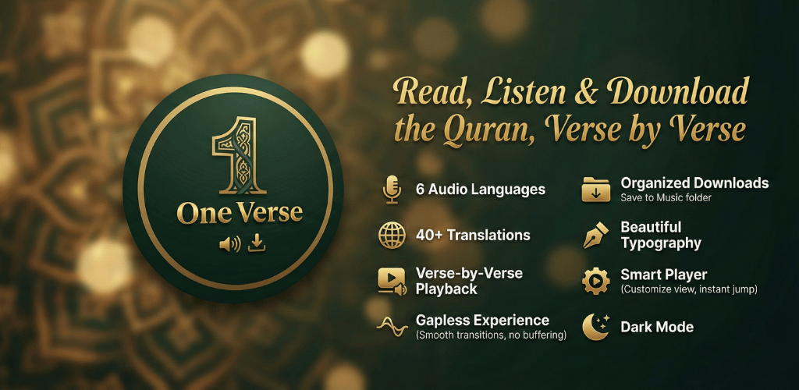
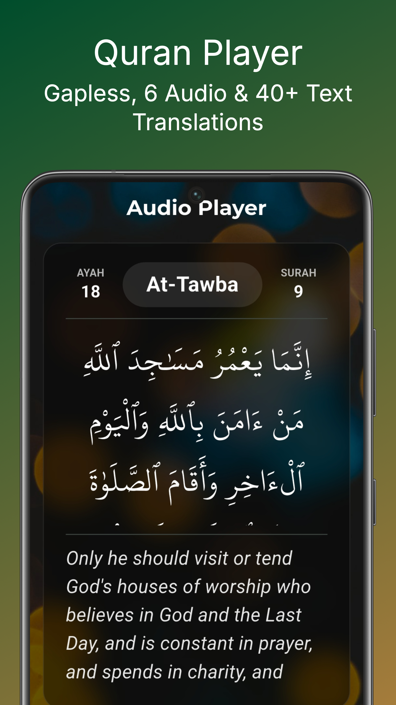
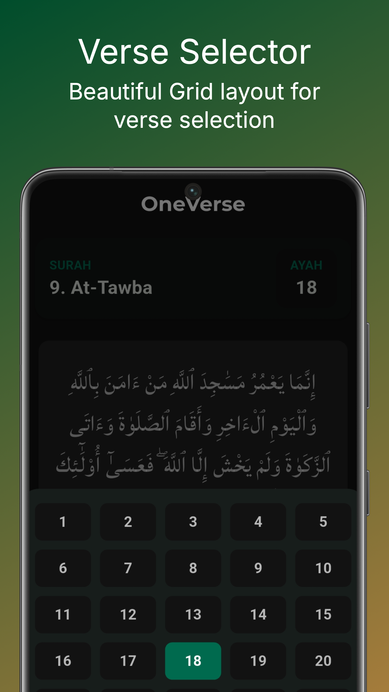
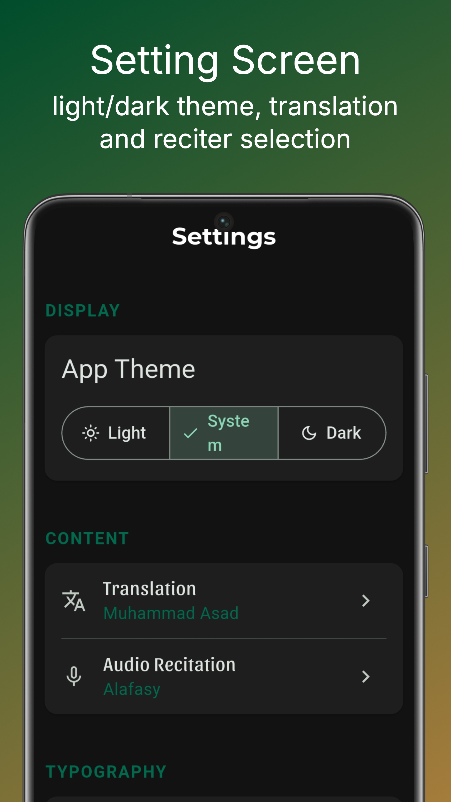

# One Verse - Al Quran MP3 Audio 📖🎧

 
**Connect with the Quran, One Verse at a Time.**

One Verse is a premium, open-source Flutter application designed for deep spiritual connection through verse-by-verse recitation and understanding. Built with a focus on performance, gapless playback, and offline capability, it serves as a perfect companion for daily listeners, travelers, and Islamic content creators.

---

## 🌟 Key Features

### 🎧 Seamless Audio Experience
* **Gapless Playback:** Advanced pre-fetching technology ensures zero lag between verses. Perfect for driving or continuous listening.
* **20+ Famous Reciters:** Includes Sheikh Sudais, Mishary Al-Afasy, Shuraim, and many more.
* **5 Audio Translations:** Listen to the Quran's meaning in English, Urdu, and other languages.

### 📚 Rich Content & Understanding
* **40+ Text Translations:** Read meanings in Urdu, Hindi, Bengali, English, Spanish, and more.
* **Authentic Typography:** Uses the **KFGQPC Uthmanic Script HAFS** font for a genuine Mushaf reading experience.
* **Smart Player UI:** Toggle easily between **Arabic Only**, **Translation Only**, or **Split View**.

### 💾 Powerful Download Manager
* **Structured Downloads:** Downloads verses directly to your device's `Music/OneVerse` directory.
* **Organized Folders:** Files are saved as `Language > Reciter > Surah > Ayah.mp3`, making it an excellent tool for **Content Creators** to find specific audio clips.
* **Offline Mode:** Once downloaded, listen anywhere without internet.

### 🎨 Customization & Accessibility
* **Themes:** Beautiful Dark Mode (Emerald & Gold) and Light Mode.
* **Typography Settings:** Adjust Arabic and Translation font sizes independently.
* **Navigation:** Jump to any Surah or Ayah instantly with the search grid.

---

## 📱 App Screenshots

| Home Screen | Audio Player | Selection Verses | Settings |
|:-----------:|:------------:|:--------------:|:--------:|
|  |  |  |  |

---

## 🛠️ Tech Stack

* **Framework:** [Flutter](https://flutter.dev/) (Dart)
* **State Management:** [Provider](https://pub.dev/packages/provider)
* **Audio Engine:** [Just Audio](https://pub.dev/packages/just_audio) (with background support)
* **Networking:** [Dio](https://pub.dev/packages/dio) & [Http](https://pub.dev/packages/http)
* **Local Storage:** [Shared Preferences](https://pub.dev/packages/shared_preferences)
* **Permissions:** [Permission Handler](https://pub.dev/packages/permission_handler)
* **API:** [AlQuran.cloud](https://alquran.cloud/api)

---

## 🚀 Getting Started

Follow these steps to run the project locally.

### Prerequisites
* Flutter SDK (3.x.x or higher)
* Dart SDK
* Android Studio / VS Code

### Installation

1.  **Clone the repository**
    ```bash
    git clone [https://github.com/thenasihun/one-verse.git](https://github.com/thenasihun/one-verse.git)
    cd one-verse
    ```

2.  **Install dependencies**
    ```bash
    flutter pub get
    ```

3.  **Generate Assets (Icons & Splash)**
    ```bash
    flutter pub run flutter_launcher_icons
    flutter pub run flutter_native_splash:create
    ```

4.  **Run the app**
    ```bash
    flutter run
    ```

---

## 📂 Project Structure
```
lib/
├── core/
│   ├── constants/          # App constants and configuration
│   ├── themes/             # Dark & Light theme definitions
│   └── utils/              # Helper utilities
├── models/
│   ├── surah_model.dart    # Surah data structure
│   ├── ayah_model.dart     # Ayah/Verse data structure
│   └── edition_model.dart  # Audio & Text editions
├── providers/
│   ├── audio_provider.dart # Audio playback state
│   ├── quran_provider.dart # Quranic data management
│   └── settings_provider.dart # User preferences & themes
├── screens/
│   ├── home_screen.dart    # Main home page
│   ├── player_screen.dart  # Audio player interface
│   ├── settings_screen.dart # User settings & customization
│   └── info_screen.dart    # About & documentation
├── services/
│   └── quran_api_service.dart # AlQuran.cloud API integration
├── utils/
│   └── download_manager.dart # Audio file download handling
└── widgets/
    ├── player_controls.dart    # Play/pause buttons
    ├── verse_card.dart         # Verse display widget
    └── custom_app_bar.dart     # Reusable app bar
```

---

## 📦 Building for Release

To generate a release Android App Bundle (.aab) for the Play Store:

1.  Ensure you have your `key.properties` and `upload-keystore.jks` setup in the `android/` directory.
2.  Run the build command:
    ```bash
    flutter build appbundle --release
    ```
    *Output location:* `build/app/outputs/bundle/release/app-release.aab`

---

## 🤝 Contributing

Contributions are welcome! If you have suggestions for new features (like bookmarking or more reciters), please fork the repo and create a pull request.

1.  Fork the Project
2.  Create your Feature Branch (`git checkout -b feature/AmazingFeature`)
3.  Commit your Changes (`git commit -m 'Add some AmazingFeature'`)
4.  Push to the Branch (`git push origin feature/AmazingFeature`)
5.  Open a Pull Request

---

## 📄 Privacy Policy

This app respects user privacy. It does not collect any personal data.
Storage permissions are requested solely for downloading Quranic audio files to your local device.
[Read Full Privacy Policy](https://thenasihun.github.io/One-Verse/privacy_policy.html)

---

## ❤️ Acknowledgements

* **API:** Thanks to [AlQuran.cloud](https://alquran.cloud) for their incredible API service.
* **Font:** KFGQPC Uthmanic Script HAFS.
* **Developed by:** [Nasihun.com](https://nasihun.com)

---

**Download on Google Play:**
[](https://play.google.com/store/apps/details?id=com.nasihun.oneverse)